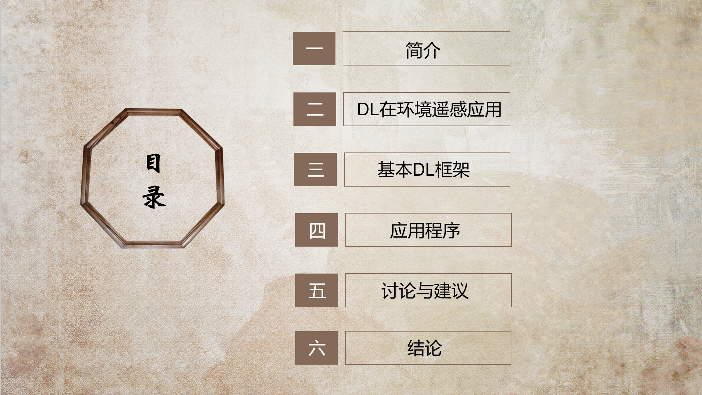

# 珈玮主要从一下六个方面给我们介绍了Deep Learning In Environmental Remote Sensing: Achievements and Challenges这篇文章
-----------------------------
 [Paper](https://www.sciencedirect.com/science/article/abs/pii/S0034425720300857) |
******

